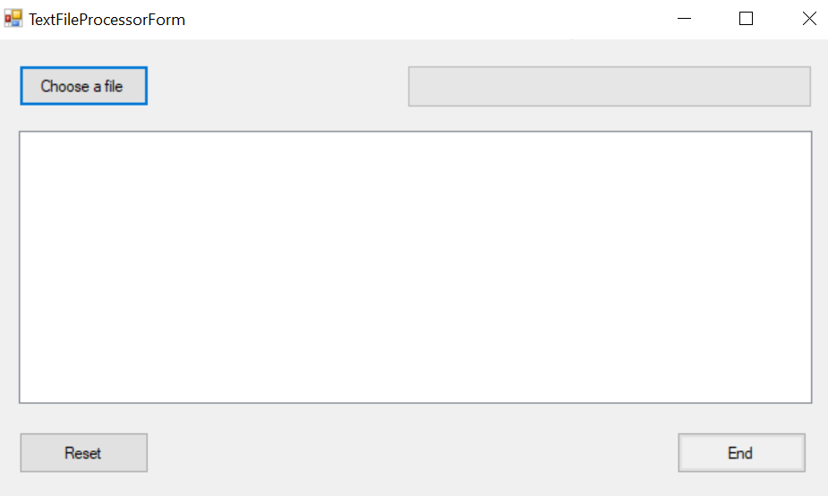
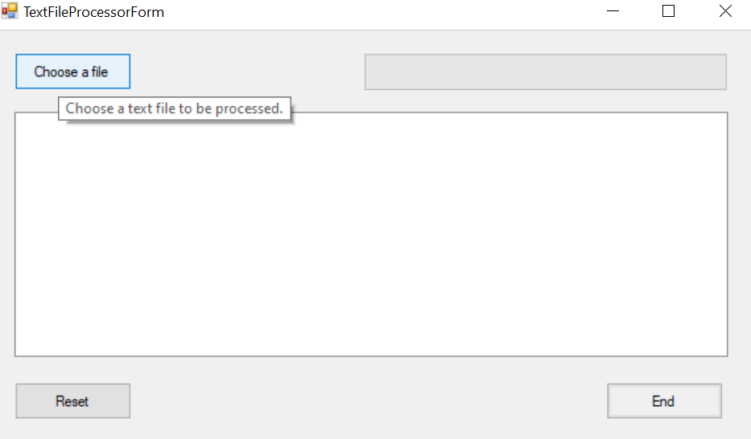
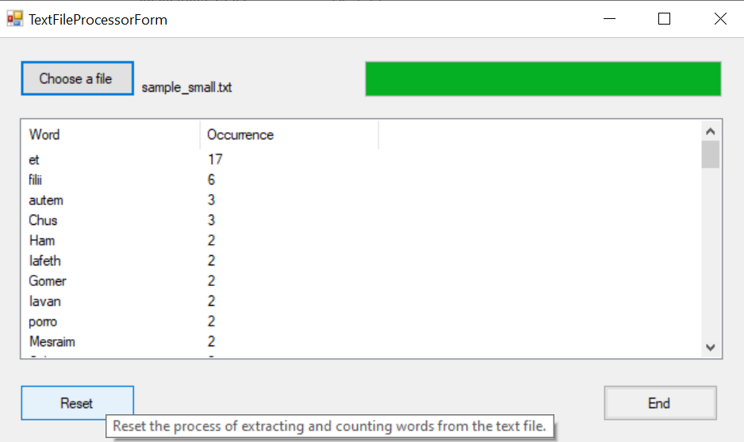
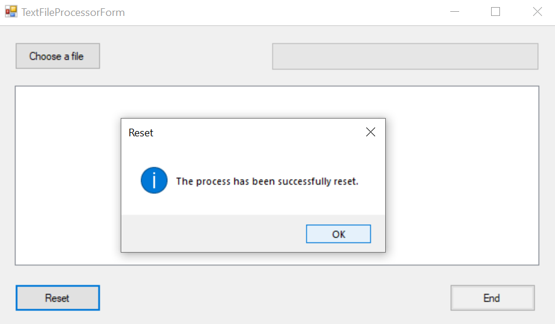

# TextFileProcessing
A C# .NET Framework application that extracts and counts the words from a text file using a Windows Form interface.
The purpose of this example is to demonstrate an approach for solving a problem for an actual user.
Below, there is a description of the scenario.

Scenario

-	A customer needs a small utility for processing a text file.

The user interface shall allow the user to specify the text file to be processed.

Note: Hovering your mouse over a button or menu item can provide additional explanations and instructions on what to do.

-	This file shall be analyzed and all the words within the file shall be extracted and counted.
As a result, a simple two-column table shall be shown.
The first column shall contain words, while the second one shall contain their occurrences.
The table shall be sorted by the number of occurrences.
It shall be considered that large text files (~50 MB) will be processed, and as such, the user interface shall show a progress bar.

-	The user shall be able to cancel the processing of the file.
The user interface is responsive even during parsing the file so that the user can still interact with the application.

-  User will be prompted with a message box to confirm the action (end/reset).

